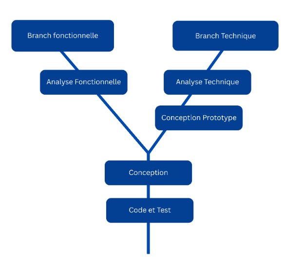
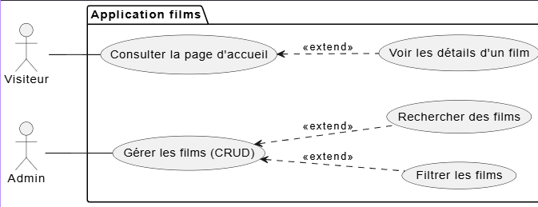
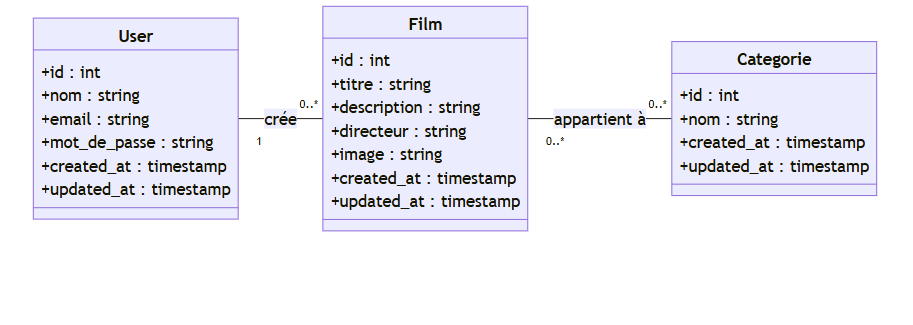

<!-- Page de garde -->
# Présentation Projet technique
### Application de gestion et filtrage des films
**Présentée par : Salma Akajou**  
**Encadré par : M. Fouad Essarraj**  
**Date : 05/01/2026**

---

<!-- Choix du sujet -->
# Choix du sujet
**gestion des films**

---

<!-- Contexte -->
# Contexte

---

<!-- Analyse technique -->
# Besoin - Analyse Technique

**Technologies à utiliser :**

1. **Base de données** : MySQL,
2. **Framework** : Laravel,
3. **Architecture n-tiers** : Services,
4. **Architecture** : MVC,
5. **Moteur de vues** : Blades,
6. **Ajax**,
7. **Upload images**,
8. **Laravel Multilangue**s,
9. **Vite**,
10. **Preline UI library**
11. **Lucide Library**
12. **Css tailwind**

---

<!-- Fonctionnalités -->
# Analyse - Fonctionnalités 

---

<!-- Conception -->
# Conception

---

<!-- Sujet de Live coding -->
# Sujet de Live coding
- Un bouton “Ajouter” qui ouvre une modale pour créer un nouvel élément.
- Une barre de recherche filtrant des éléments par titre.
